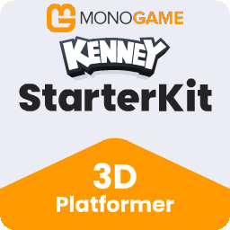
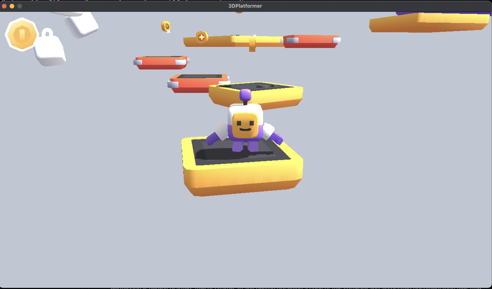

# Starter Kit 3D Platformer

This repository has a basic template for a 3D platformer game.
The [original](https://github.com/KenneyNL/Starter-Kit-3D-Platformer) was written by [Kenney](https://www.kenney.nl/starter-kits) for Godot 4.3 (stable).

Includes features like;

- Character controller (with double jump)
- Collectable coins and falling platforms
- Camera controls (rotate, zoom)
- Gamepad support
- Basic Convex Hull Collision System
- Uses Blender for Level Editing
- Sprites and 3D Models _(CC0 licensed)_
- Sound effects _(CC0 licensed)_

## Screenshot

## Controls

- Standard keyboard controls (WASD, Space), plus GamePad support
- Camera controls (Arrows to move), Comma/Period Zoom

## Build Instructions

- Make sure your system is setup for MonoGame development by following the documentation at [https://docs.monogame.net/](https://docs.monogame.net/)
- Clone the repository.
- `dotnet build Starter-Kit-3D-Platformer.sln`
- `dotnet run --project Platforms/Desktop/Desktop.csproj`

For debug builds we define a `DEVMODE` conditional define. This is used to make sure
development code is not included in the final build.

When in debug mode you can use the following keys to show/see debug information.

- F1 : Show/Hide collision meshes
- F2 : Show/Hide RenderTargets for Shadow and Post Process'.
- F3 : Show/Hide Performance Metrics.
- +/- : Speed up or slow time the game time. Useful for debugging animations.
- M : Mute/UnMute the Music.

## Project Layout

The Starter Kit 3D Platformer is organized into several key directories, each serving a specific purpose in the game's architecture:

### Core Projects

- **Source/** - Contains the main game code and logic
  - **PlatformerGame.cs** - The entry point and main game loop
  - **Base/** - Core engine components like Scene, Camera, Entity, and collision systems
  - **Entities/** - All game entity implementations (Player, Coins, Platforms, etc.)

- **Content/** - Houses all game assets
  - **Models/** - 3D models for characters, platforms etc.
  - **Textures/** - Sprite sheets, UI elements, and textures
  - **Effects/** - Shader effects like Bloom, Shadow, and Vignette
  - **Font/** - Font files and spritefont definitions
  - **Sounds/** - Sound effects and music files
  - **Content.mgcb** - MonoGame Content Builder project file
  - **level*.json** - Level definition files exported from Blender
  - **levels.json** - Index of all available levels

- **Pipeline/** - Custom content processing
  - **ConvexHullHelper.cs** - Generates collision meshes from 3D models
  - **MeshAnimatedModelProcessor.cs** - Processes animated models
  - **MeshAnimatedModelHelper.cs** - Utilities for model processing
  - **Pipeline.csproj** - MonoGame Content Pipeline extension project

- **Platforms/** - Platform-specific implementations
  - **Desktop/** - Desktop (Windows/macOS/Linux) implementation
    - **Program.cs** - Entry point for desktop applications
    - **Desktop.csproj** - Project file for desktop builds

- **Blender/** - Level editing tools
  - **level.blend** - Main Blender file for level editing
  - **AddMenu.py** - Adds export menu to Blender
  - **ExportScript.py** - Exports level data to JSON

## Level Editing

This sample uses Blender to create levels. The entire game is made up of these building blocks of meshes.

> [!NOTE]
> For more details on the Blender Integration, see [this guide](./Documentation/00-BlenderPipeline.md)

## Ideas for Improvements

This is your Starter Kit! So you can modify it , extend it, take things out.

Here are some thoughts on things that could be added:

- Rotating Platforms.
- Enemies
- Other Collectables
- Power Enhancement Pickups.
- Local Co-op
- Swap out the artwork.

## License

MIT License

Copyright (c) 2024 Kenney

Copyright (c) 2025 MonoGame Foundation, Inc.

Permission is hereby granted, free of charge, to any person obtaining a copy of this software and associated documentation files (the "Software"), to deal in the Software without restriction, including without limitation the rights to use, copy, modify, merge, publish, distribute, sublicense, and/or sell copies of the Software, and to permit persons to whom the Software is furnished to do so, subject to the following conditions:

The above copyright notice and this permission notice shall be included in all copies or substantial portions of the Software.

THE SOFTWARE IS PROVIDED "AS IS", WITHOUT WARRANTY OF ANY KIND, EXPRESS OR IMPLIED, INCLUDING BUT NOT LIMITED TO THE WARRANTIES OF MERCHANTABILITY, FITNESS FOR A PARTICULAR PURPOSE AND NONINFRINGEMENT. IN NO EVENT SHALL THE AUTHORS OR COPYRIGHT HOLDERS BE LIABLE FOR ANY CLAIM, DAMAGES OR OTHER LIABILITY, WHETHER IN AN ACTION OF CONTRACT, TORT OR OTHERWISE, ARISING FROM, OUT OF OR IN CONNECTION WITH THE SOFTWARE OR THE USE OR OTHER DEALINGS IN THE SOFTWARE.

Assets included in this package (2D sprites, 3D models and sound effects) are [CC0 licensed](https://creativecommons.org/publicdomain/zero/1.0/)
